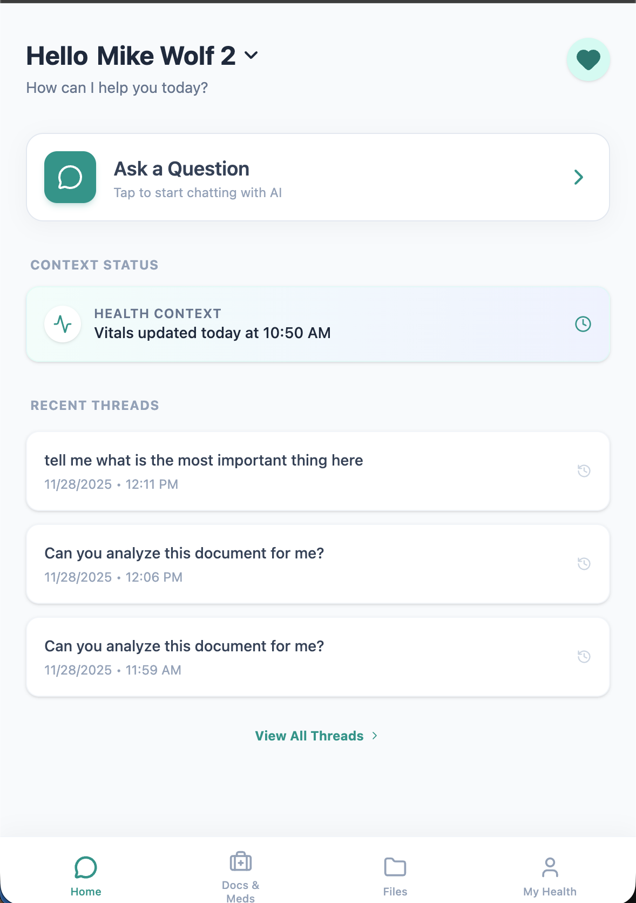

# CareCompass


> **⚠️ DISCLAIMER: PROOF OF CONCEPT ONLY**
> This project is a **Proof of Concept (PoC)** created for demonstration and educational purposes only. It is **NOT** intended for production use and should **NOT** be used to store real, sensitive medical data. The security measures implemented (while functional) have not been audited for HIPAA or GDPR compliance. Use at your own risk.

---

Patients and caregivers today have a lot on their plate. Many use ChatGPT to get medical advice, but the value here depends on you having the right context at hand. Further, tools like GPT are not set up to handle medical information in a secure way. Also, these tools require you to understand how to prompt them in the right way.

Thus CareCompass is here to help.

CareCompass is a secure, AI-powered personal health assistant designed to help users manage medical information for themselves and their loved ones. It combines robust data encryption with advanced LLM capabilities (Google Gemini) to provide intelligent insights, document analysis, and organized health tracking.

The idea came from a conversation with Dr. Layson-Wolf and Ian Suttle. The solution makes heavy use of Gemini 1.5 Pro and Antigravity in its development. Time spent in development is < 1 day from inception to current state over the Thanksgiving break.  So you know, take this with a grain of salt and more a concept piece than anything else.

## Key Features



### 1. Configuration
The application relies on a configuration directory `CareCompassApp/config/`.

1.  **Firebase Service Account**:
    *   Go to Firebase Console -> Project Settings -> Service Accounts.
    *   Generate a new private key.
    *   Save the file as `CareCompassApp/config/firebaseConfig.json`.

2.  **Secrets Configuration**:
    *   Create a new file `CareCompassApp/config/secrets.yaml`. See 
    *   Update the following fields:
        ```yaml
        gemini_api_key: "YOUR_GEMINI_API_KEY"
        firebase_service_account_path: "config/firebaseConfig.json"
        encryption_key: "YOUR_GENERATED_KEY" 
        ```
    *   *Note*: To generate a valid encryption key, run:
        ```bash
        python3 backend/generate_key.py
        ```
        Copy the output and paste it into `secrets.yaml`.

3.  **Frontend Firebase Config**:
    *   Update `CareCompassApp/frontend/src/firebase.js` with your Firebase Web App configuration (API Key, Auth Domain, etc.) found in Project Settings.

### 2. Backend Setup
The backend is a Flask application that handles encryption, database interactions, and AI orchestration.

```bash
cd CareCompassApp/backend

# Install dependencies
pip install -r requirements.txt

# Run the server
python3 app.py
```
*The backend runs on `http://localhost:5000`.*

### 3. Frontend Setup
The frontend is a modern React application built with Vite and Tailwind CSS.

```bash
cd CareCompassApp/frontend

# Install dependencies
npm install

# Run the development server
npm run dev
```
*The frontend runs on `http://localhost:5173`.*

---
## currently set up to run with github actions
see SETUP_GITHUB_ACTIONS.md for instructions

## Troubleshooting

*   **"Bucket not found" error**: Ensure you have enabled "Storage" in your Firebase Console and that the bucket name in `backend/app.py` matches your Firebase Storage bucket URL (usually `project-id.firebasestorage.app`).
*   **Data not saving**: Check the backend logs. If you see `>> SAVING TO MEMORY`, it means the backend couldn't find or validate your `firebaseConfig.json`. Ensure the path in `secrets.yaml` is correct.

## Directory Structure

```
CareCompass/
├── .github/workflows/      # CI/CD workflows
├── CareCompassApp/
│   ├── backend/            # Flask backend (Python)
│   │   ├── app.py          # Main application logic
│   │   ├── utils.py        # Encryption & Config utilities
│   │   └── Dockerfile      # Backend container definition
│   ├── config/             # Configuration files
│   ├── frontend/           # React frontend (Vite)
│   │   ├── src/            # Frontend source code
│   │   └── index.html      # Entry point
│   ├── cloudbuild.yaml     # Google Cloud Build config
│   └── firebase.json       # Firebase Hosting config
├── SETUP_GITHUB_ACTIONS.md # Deployment setup guide
└── README.md               # Project documentation
```
